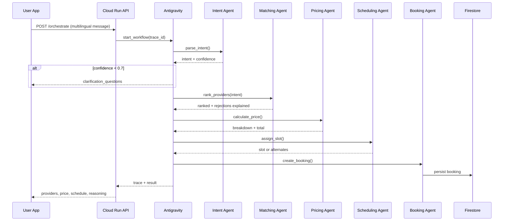

# ServiceFlow AI — System Architecture

## 1. Vision

Autonomous AI orchestration for informal economy services — replacing WhatsApp chaos with trust, transparent pricing, intelligent scheduling, and full lifecycle automation.

## 2. Google Cloud Service Map

| Capability | Primary GCP Service | Fallback |
|------------|---------------------|----------|
| Central orchestration | **Google Antigravity** + Gemini | Local agent pipeline |
| LLM / agents | Vertex AI, Gemini API | Rule-based parsers |
| Intent & NLU | Gemini + Cloud Translation + Natural Language API | Regex + keyword |
| Embeddings / search | Vertex AI Embeddings, Vertex AI Search | In-memory cosine |
| Compute API | **Cloud Run** | Docker local |
| Async events | **Pub/Sub**, Eventarc | In-process queue |
| Workflows | **Google Workflows** | Python workflow engine |
| Primary DB | **Firestore** | JSON file store (demo) |
| Analytics DB | **Cloud SQL (PostgreSQL)** + **BigQuery** | SQLite |
| Auth | **Firebase Authentication** | Demo JWT |
| Push | **FCM** | In-app notifications |
| WhatsApp/SMS | Twilio + Cloud Functions | Log simulation |
| Maps / routing | Maps, Places, Distance Matrix, Geocoding | Haversine estimate |
| Voice | Speech-to-Text, Text-to-Speech | Browser Web Speech |
| Storage | Cloud Storage | Local `/uploads` |
| Observability | Cloud Logging, Monitoring, Error Reporting, Trace | Structured logs |
| Dashboards | Looker Studio | Admin UI charts |

## 3. Multi-Agent Architecture

```
                    ┌─────────────────────────────┐
                    │  Antigravity Orchestrator   │
                    │  (Workflow Orchestrator)    │
                    └──────────────┬──────────────┘
                                   │
     ┌─────────────┬───────────────┼───────────────┬─────────────┐
     ▼             ▼               ▼               ▼             ▼
 Language      Intent          Risk           Matching      Pricing
  Agent         Agent          Agent            Agent         Agent
     │             │               │               │             │
     └─────────────┴───────────────┼───────────────┴─────────────┘
                                   ▼
                          Scheduling Agent
                                   │
                    ┌──────────────┼──────────────┐
                    ▼              ▼              ▼
              Booking Agent  Notification   Reputation
                    │          Agent           Agent
                    ▼              │              │
              Dispute Agent ◄──────┴──────────────┘
                    │
              Escalation Agent
```

### Agent responsibilities

1. **Language Parsing** — detect Urdu/Roman/English/mixed, normalize text
2. **Intent Understanding** — extract service, urgency, location, budget, constraints
3. **Risk Assessment** — fraud, high-risk jobs, spam providers
4. **Provider Matching** — 14-factor weighted ranking + explanations
5. **Dynamic Pricing** — surge, urgency, complexity, loyalty
6. **Scheduling** — slots, buffers, conflicts, waitlist
7. **Booking** — lifecycle state machine
8. **Notification** — FCM, WhatsApp templates, reminders
9. **Reputation** — dynamic trust scores
10. **Dispute Resolution** — compensation, refunds, audit
11. **Escalation** — admin handoff when confidence/risk thresholds exceeded
12. **Workflow Orchestrator** — chains, retries, fallbacks (Antigravity core)

## 4. Orchestration Flow (Sequence)



## 5. Provider Matching (14 Factors)

Weighted composite score (configurable in `backend/app/config/matching_weights.py`):

| Factor | Weight (default) |
|--------|------------------|
| Distance / travel time | 12% |
| Availability | 10% |
| Reliability score | 12% |
| Rating | 8% |
| Review recency | 5% |
| Specialization match | 14% |
| Price compatibility | 10% |
| Cancellation history | 8% |
| Workload / capacity | 7% |
| User preferences | 5% |
| On-time score | 6% |
| Risk score | 5% |
| Job complexity fit | 5% |
| Completion history | 3% |

## 6. Data Model (Summary)

- **users** — profile, preferences, loyalty tier, language
- **providers** — skills, geo, rates, metrics, availability
- **bookings** — full lifecycle states
- **pricing_quotes** — line-item breakdowns
- **reviews** — ratings linked to reputation updates
- **disputes** — type, resolution, compensation
- **schedules** — provider slots + buffers
- **notifications** — delivery status
- **ai_traces** — agent reasoning chains
- **reputation_metrics** — time-series trust scores
- **service_categories** — taxonomy + complexity rules

Full DDL: [database/schemas/postgres.sql](../database/schemas/postgres.sql)  
Firestore: [database/schemas/firestore.md](../database/schemas/firestore.md)

## 7. Booking Lifecycle States

```
draft → intent_parsed → providers_ranked → priced → scheduled
  → confirmed → provider_assigned → reminder_sent → en_route
  → arrived → in_progress → completed → invoiced → reviewed
  → closed

Branches: cancelled, disputed, escalated, rescheduled, waitlisted
```

## 8. Robustness & Fallbacks

| Edge case | Handling |
|-----------|----------|
| Low confidence parse | Clarification agent + Escalation threshold |
| No providers | Waitlist + broaden radius + notify ops |
| Maps API failure | Haversine + cached distances |
| Payment failure | Retry 3x → hold booking → user prompt |
| Provider cancel | Auto-reschedule workflow (Pub/Sub) |
| Schedule conflict | Alternate slots + buffer recalc |
| Network failure | Offline queue (PWA) + idempotent APIs |

## 9. Security

- Firebase Auth JWT on all `/api/v1/*` routes (demo mode optional)
- Secret Manager for API keys
- Firestore security rules per role (user/provider/admin)
- Audit logs for disputes and AI decisions

## 10. Scalability

- Cloud Run autoscaling (CPU/concurrency)
- Firestore for hot paths; BigQuery for analytics
- Pub/Sub decouples notifications and workflows
- Vertex AI batch for demand forecasting (pipeline)
